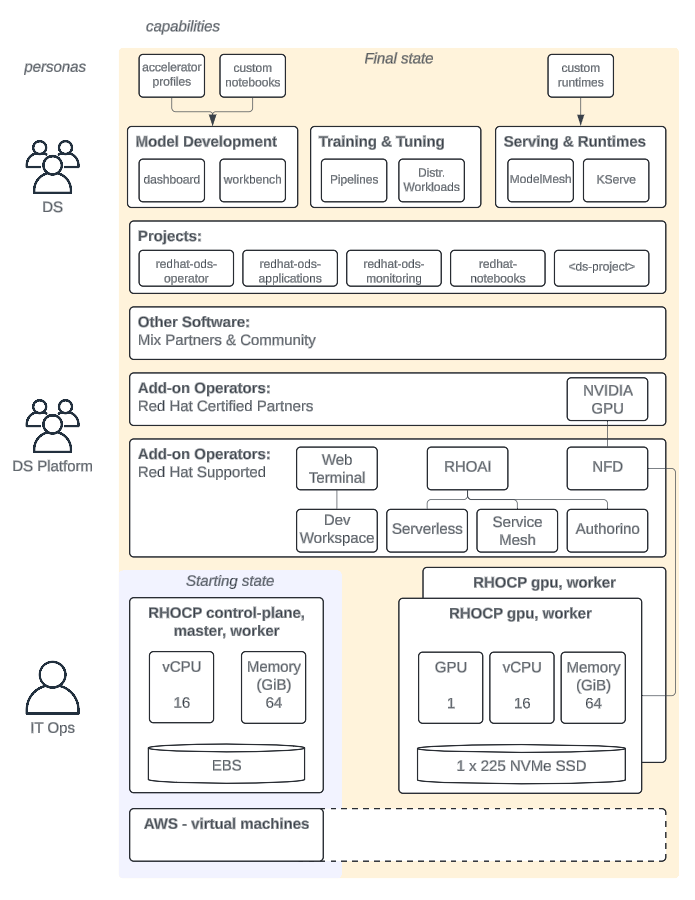

# Hobbyist Guide to install RHOAI

This is a Hobbyist Guide to Installing and Configuring RHOAI for customer proof of concept environments. This repo is intentionally imperative to aggregate the various official docs into a single markdown sequence and paves the way for declarative automation in the [ai-gitops-catalog](https://github.com/redhat-na-ssa/demo-ai-gitops-catalog).

The intended outcome is to have all RHOAI stable components enabled and dependencies installed on a cluster with 1x control plane/worker and 2x worker GPU EC2 instances capable of delivering the current official docs demos: Fraud Detection and Distributed Workloads.

- OCP Instance: AWS with OpenShift Open Environment
- OCP Version: 4.15
- RHOAI Version: stable-2.10

Starting from a single RHOCP control-plane, master, worker we will provision the rest of the objects illustrated and provide two different official demonstrations on the platform.



```shell
.
├── LICENSE
├── README.md
├── notes
│   ├── 00_FEATURES.md                  # Overview of the features in RHOAI
│   ├── 01_DASHBOARD.md                 # Deep dive into the RHOAI dashboard
│   ├── 02_CHECKLIST.md                 # Technical overview for RHOAI install/config
│   ├── 03_CHECKLIST_PROCEDURE.md       # Additional detailed steps
│   ├── 04_TUTORIAL_FRAUD.md            # Notes for the fraud detection demo
│   ├── 05_TUTORIAL_DISTR_WORKLOADS.md  # Notes for the distributed workloads demo
│   ├── 06_APPENDIX.md                  # Additional configurations for Unmanaged dependencies
│   └── configs                         # These are the config files used in the 03_CHECKLIST_PROCEDURE.md
```
